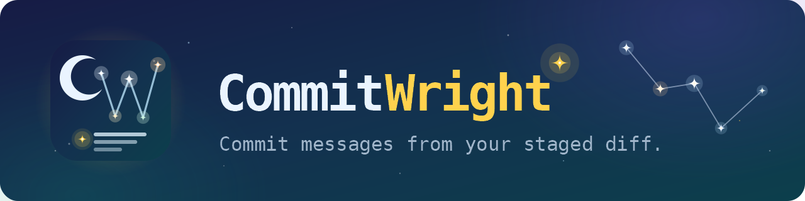
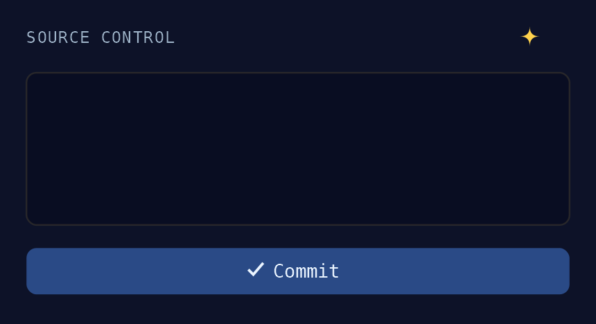
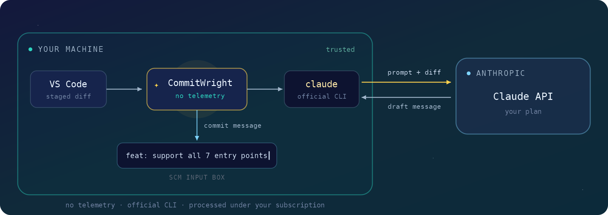
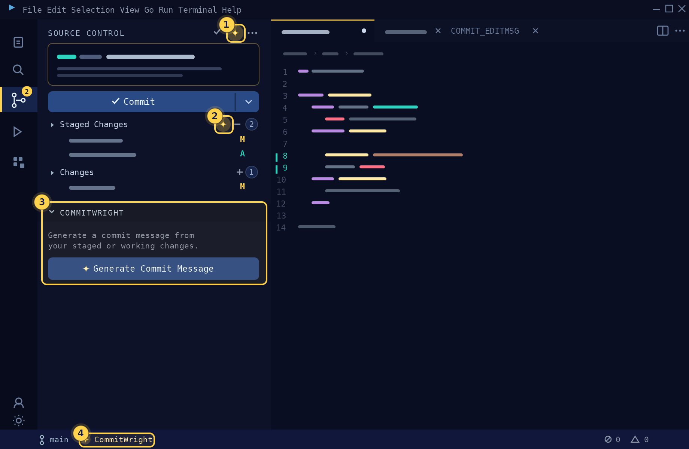
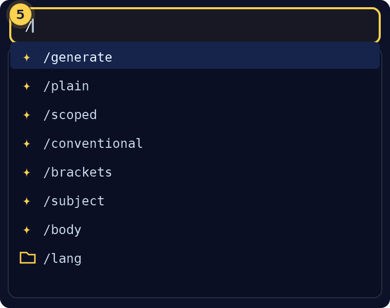
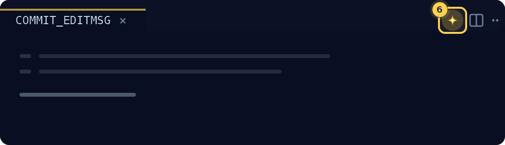

🇺🇸 **English** | [🇷🇺 Русский](README.ru.md)

# CommitWright — AI Commit Messages (Claude CLI)

**Commit messages from your staged diff.** A ✨ button in VS Code's Source Control panel drafts your commit message with the Claude CLI you already have — on your existing subscription, no separate API key.

Stage your changes, click ✨, review the draft, commit. The message lands in the commit box as editable text — you always get the final word.

## Why CommitWright

- **Your subscription, no API key.** It drives the official [`claude` CLI](https://claude.com/claude-code) you have already installed and logged into. Nothing else to sign up for.
- **Zero telemetry of its own.** The extension collects nothing and sends nothing anywhere — it only runs the local binary. Details in [Privacy](#privacy--what-gets-sent).
- **Your style, your language.** Four subject styles, subject-only or subject + body, and any output language — English, Russian, German… even Elvish.
- **Works where you do.** Six entry points plus a hotkey, each one can be switched off.

## Quick start

1. Install the [Claude Code CLI](https://claude.com/claude-code) and log in: run `claude` in a terminal, then `/login`. CommitWright requires it.
2. Install **CommitWright**.
3. Open a Git repository, stage some changes, and click the ✨ button in the Source Control title bar — or press `Ctrl+Alt+G` (`Cmd+Alt+G` on macOS).

> **Windows tip:** if `claude` is not on your `PATH`, point `commitwright.cliPath` at the executable with an absolute path.

## How it works

CommitWright runs the official Anthropic CLI (`claude`) that you install and authorize yourself. On click it collects the diff, pipes it to `claude -p` together with a prompt, and inserts the reply into the commit message box. The extension never stores, extracts, or transmits your token — authentication stays entirely inside the official binary.

A few deliberate guardrails:

- The CLI runs with tools disabled and an isolated working directory: it cannot read your project beyond the diff it is given, and your project's own Claude configuration does not leak into the message.
- Lock files (`package-lock.json`, `yarn.lock`, …) are excluded from the diff automatically; very large diffs are truncated.
- Untracked files are included when generating from all changes, so brand-new files get described too.

## Entry points

| # | Entry point | Default |
|---|-------------|---------|
| 1 | **Source Control title button**, next to the built-in actions | on |
| 2 | **Inline action** on the Staged Changes / Changes group header | on |
| 3 | **CommitWright panel** in Source Control, with a labeled button | off |
| 4 | **Status bar item**, next to the branch indicator | on |
| 5 | **Slash commands** in the commit box (see below) | on |
| 6 | **Commit editor button**, when Git opens `COMMIT_EDITMSG` as a tab | on |
| — | **Hotkey** `Ctrl+Alt+G` / `Cmd+Alt+G`, and the Command Palette | — |

Run **CommitWright: Configure Entry Points** for a checkbox list of all of them, and use `commitwright.position.scmTitle` to pin the title button to the left or right edge.

### Slash commands

Type `/` as the first character of the commit box to generate with a one-off override of your defaults — `/conventional` writes this one message in Conventional style, `/body` adds a body, `/lang` picks a language:

### Commit editor button

If you commit with the full editor (`COMMIT_EDITMSG` tab), the same ✨ lives in its toolbar:

## Settings

| Setting | Default | What it does |
|---------|---------|--------------|
| `commitwright.style` | `plain` | Subject style: `plain` (no prefix), `scoped` (`api: add rate limiter`), `conventional` (`feat(api): add rate limiter`), `brackets` (`[FEATURE] Add rate limiter`). |
| `commitwright.messageMode` | `subject` | Generate just the subject line, or subject + explanatory body. |
| `commitwright.commitLanguage` | `auto` | Output language. `auto` follows the VS Code display language; or type any language name. |
| `commitwright.diffSource` | `auto` | Which changes to describe: staged if any, else all (`auto`) — or strictly `staged` / `all`. |
| `commitwright.includeChangedFiles` | `true` | Add the changed-file list to the prompt — helps the model pick the right scope. |
| `commitwright.extraInstructions` | — | Your free-form rules, added to the prompt. |
| `commitwright.promptTemplate` | — | Replace the built-in prompt entirely. Placeholders: `{$diff}`, `{$lang}`, `{$style}`, `{$tags}`, `{$extra}`, `{$files}`. |
| `commitwright.model` | CLI default | Model alias or full name (`haiku`, `sonnet`, `opus`, …). Easiest via **CommitWright: Select Model**. |
| `commitwright.effort` | `low` | Thinking effort. `low` is plenty for a commit message; higher levels are slower and spend more of your credit. |
| `commitwright.cliPath` | `claude` | Path to the CLI. Use an absolute path if it is not on `PATH` (common on Windows). |
| `commitwright.timeoutMs` | `60000` | Timeout for the CLI call, in milliseconds. |
| `commitwright.entrypoints` | object | Visibility toggle per entry point — or run **CommitWright: Configure Entry Points**. |
| `commitwright.position.scmTitle` | `right` | Title-bar button at the left or right edge of the actions. |

Commands in the palette: **Generate Commit Message** · **Select Commit Language** · **Select Model** · **Configure Entry Points**.

## Billing

> **Change effective June 15, 2026:** programmatic CLI calls (`claude -p`, which CommitWright uses) are billed against a separate monthly **Agent SDK credit** included in Claude subscriptions — not against your interactive chat limits. You activate the credit once in your Claude account settings; it renews monthly and does not roll over. When it runs out, generation stops with a clear error (or continues at standard API rates if you have enabled extra usage).

Commit-message generation is lightweight — a short diff in, a line or two out — so a plan's monthly credit typically covers hundreds of generations. It is **not** free and **not** unlimited, though: see [Anthropic's pricing](https://claude.com/pricing) and the Help Center article [Use the Claude Agent SDK with your Claude plan](https://support.claude.com/en/articles/15036540) for current terms.

**Tip:** a commit message does not need a frontier model. Pick `haiku` or `sonnet` via **CommitWright: Select Model** — faster and cheaper than a top-tier default. `effort` already defaults to `low` for the same reason.

## Privacy — what gets sent

The extension itself collects **no telemetry** and sends nothing anywhere. It starts one local process — the official `claude` binary — and reads back its output. Your token is never touched.

What goes into the prompt (and only to the CLI):

- the diff — staged or working changes, per `diffSource`;
- the changed file names, if `includeChangedFiles` is on (default);
- your `extraInstructions` / `promptTemplate`, if set.

`claude` is **not a local model**: it sends the prompt to Anthropic's servers, and processing happens under the terms of *your* subscription. On consumer plans (Free/Pro/Max) the diff content **may** be used for model training if the "Model Training" toggle in your Claude privacy settings is on. Working with confidential code? Turn that toggle off — or use an API key: under commercial terms, training is off by default.

### Where this stands with Anthropic's terms

Driving the official CLI on your own subscription is a pattern Anthropic itself ships: the official [claude-code-action](https://github.com/anthropics/claude-code-action) does it, and the [headless docs](https://code.claude.com/docs/en/headless) show `git diff | claude -p` pipelines. What Anthropic prohibits is third-party tools that *extract subscription OAuth tokens* and impersonate Claude Code to make raw API calls — CommitWright never touches your token; it only runs the binary you installed and authorized yourself. As always, the authoritative source is Anthropic's own terms, which may change.

### Prefer an API key?

Set the `ANTHROPIC_API_KEY` environment variable — the CLI will use it instead of your subscription. Calls are then billed at standard API rates under Commercial Terms (model training off by default), and the Agent SDK credit does not apply.

## FAQ

**How do I hide Copilot's own "generate commit message" sparkle?**

VS Code has no setting that hides just that one button (microsoft/vscode [#257770](https://github.com/microsoft/vscode/issues/257770) was closed without one). What works: disable the GitHub Copilot extension if you don't use it, or set `"chat.disableAIFeatures": true` to hide the built-in AI surfaces wholesale. Note that `"github.copilot.enable": { "scminput": false }` only stops Copilot *completions* in the commit box — the sparkle stays.

**Can CommitWright put its button inside the commit input box, where Copilot's sparkle is?**

Not today. That inner slot is VS Code's built-in commit-message-provider surface, and the corresponding `scm/inputBox` contribution point is still a proposed API ([#195474](https://github.com/microsoft/vscode/issues/195474)), off-limits to published extensions. That is why every AI-commit extension lives in the Source Control toolbar. If the API gets finalized, CommitWright will move in.

**Generation fails with "not logged in"?**

Run `claude` in any terminal and type `/login` once — CommitWright reuses that session.

---

CommitWright is an independent project — not affiliated with, endorsed by, or sponsored by Anthropic. "Claude" and "Anthropic" are trademarks of Anthropic PBC, used nominatively to describe the CLI this extension requires.

[MIT](LICENSE) © 2026 [mik8142](https://github.com/mik8142)
