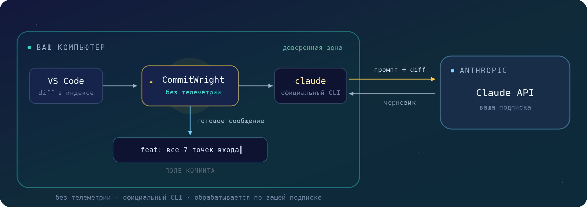
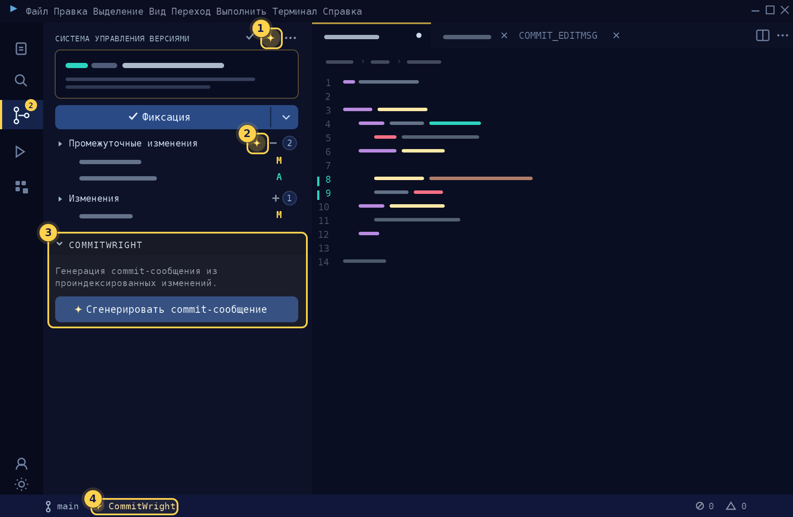

[English](README.md) | **Русский**

# CommitWright

**Commit-сообщения из вашего staged-диффа.** Кнопка ✨ в панели Source Control: черновик commit-сообщения пишет Claude CLI, который у вас уже установлен, — на вашей существующей подписке, без отдельного API-ключа.

Проиндексируйте изменения, нажмите ✨, просмотрите черновик, закоммитьте. Сообщение попадает в поле коммита обычным текстом — последнее слово всегда за вами.

## Почему CommitWright

- **Ваша подписка, без API-ключа.** Расширение запускает официальный [CLI `claude`](https://claude.com/claude-code), который вы уже установили и в котором авторизовались. Больше нигде регистрироваться не нужно.
- **Ноль собственной телеметрии.** Расширение ничего не собирает и никуда не отправляет — оно лишь запускает локальный бинарник. Подробности — в разделе [«Конфиденциальность»](#конфиденциальность--что-отправляется).
- **Ваш стиль, ваш язык.** Четыре стиля заголовка, только заголовок или заголовок + тело, любой язык сообщения — английский, русский, немецкий… хоть эльфийский.
- **Работает там же, где вы.** Шесть точек входа плюс хоткей; каждую можно отключить.

## Быстрый старт

1. Установите [Claude Code CLI](https://claude.com/claude-code) и войдите: запустите `claude` в терминале, затем `/login`. Без CLI расширение не работает.
2. Установите **CommitWright**.
3. Откройте Git-репозиторий, проиндексируйте изменения и нажмите кнопку ✨ в заголовке панели Source Control — или `Ctrl+Alt+G` (`Cmd+Alt+G` на macOS).

> **Совет для Windows:** если `claude` нет в `PATH`, укажите абсолютный путь к исполняемому файлу в настройке `commitwright.cliPath`.

## Как это работает

CommitWright запускает официальный CLI Anthropic (`claude`), который вы устанавливаете и авторизуете сами. По нажатию он собирает дифф, передаёт его в `claude -p` вместе с промптом и вставляет ответ в поле commit-сообщения. Расширение не хранит, не извлекает и не передаёт ваш токен — вся аутентификация остаётся внутри официального бинарника.

Несколько осознанных предохранителей:

- CLI запускается с отключёнными инструментами и в изолированной рабочей директории: он не может читать ваш проект за пределами переданного диффа, а Claude-конфигурация самого проекта не «протекает» в сообщение.
- Lock-файлы (`package-lock.json`, `yarn.lock`, …) автоматически исключаются из диффа; слишком большие диффы усекаются.
- При генерации из всех изменений учитываются и неотслеживаемые файлы — новые файлы тоже попадают в описание.

## Точки входа

| # | Точка входа | По умолчанию |
|---|-------------|--------------|
| 1 | **Кнопка в заголовке Source Control**, рядом со встроенными действиями | вкл |
| 2 | **Инлайн-действие** на заголовке группы «Проиндексированные изменения» / «Изменения» | вкл |
| 3 | **Панель CommitWright** в Source Control, с подписанной кнопкой | выкл |
| 4 | **Элемент строки состояния**, рядом с индикатором ветки | вкл |
| 5 | **Слэш-команды** в поле коммита (см. ниже) | вкл |
| 6 | **Кнопка редактора коммита** — когда Git открывает `COMMIT_EDITMSG` вкладкой | вкл |
| — | **Хоткей** `Ctrl+Alt+G` / `Cmd+Alt+G` и палитра команд | — |

Команда **CommitWright: Настроить точки входа** показывает их единым списком с галочками, а настройка `commitwright.position.scmTitle` прижимает кнопку заголовка к левому или правому краю.

### Слэш-команды

Введите `/` первым символом в поле коммита, чтобы сгенерировать сообщение с разовым отступлением от ваших настроек: `/conventional` напишет это сообщение в стиле Conventional, `/body` добавит тело, `/lang` выберет язык:

### Кнопка редактора коммита

Если вы коммитите через полноценный редактор (вкладка `COMMIT_EDITMSG`), та же кнопка ✨ есть и в его тулбаре:

## Настройки

| Настройка | По умолчанию | Что делает |
|-----------|--------------|------------|
| `commitwright.style` | `plain` | Стиль заголовка: `plain` (без префикса), `scoped` (`api: add rate limiter`), `conventional` (`feat(api): add rate limiter`), `brackets` (`[FEATURE] Add rate limiter`). |
| `commitwright.messageMode` | `subject` | Генерировать только строку заголовка или заголовок + поясняющее тело. |
| `commitwright.commitLanguage` | `auto` | Язык сообщения. `auto` следует языку интерфейса VS Code; можно ввести название любого языка. |
| `commitwright.diffSource` | `auto` | Какие изменения описывать: проиндексированные, если есть, иначе все (`auto`) — или строго `staged` / `all`. |
| `commitwright.includeChangedFiles` | `true` | Добавлять в промпт список изменённых файлов — помогает модели выбрать правильный scope. |
| `commitwright.extraInstructions` | — | Ваши правила в свободной форме, добавляются в промпт. |
| `commitwright.promptTemplate` | — | Полная замена встроенного промпта. Плейсхолдеры: `{$diff}`, `{$lang}`, `{$style}`, `{$tags}`, `{$extra}`, `{$files}`. |
| `commitwright.model` | дефолт CLI | Алиас или полное имя модели (`haiku`, `sonnet`, `opus`, …). Проще всего через **CommitWright: Выбрать модель**. |
| `commitwright.effort` | `low` | Глубина размышления. Для commit-сообщения хватает `low`; уровни выше — медленнее и расходуют больше кредита. |
| `commitwright.cliPath` | `claude` | Путь к CLI. Укажите абсолютный путь, если файла нет в `PATH` (частая ситуация на Windows). |
| `commitwright.timeoutMs` | `60000` | Таймаут вызова CLI, в миллисекундах. |
| `commitwright.entrypoints` | object | Переключатель видимости каждой точки входа — или команда **CommitWright: Настроить точки входа**. |
| `commitwright.position.scmTitle` | `right` | Кнопка заголовка у левого или правого края действий. |

Команды в палитре: **Сгенерировать commit-сообщение** · **Выбрать язык коммита** · **Выбрать модель** · **Настроить точки входа**.

## Биллинг

> **Изменение с 15 июня 2026:** программные вызовы CLI (`claude -p` — именно их использует CommitWright) списываются не с лимитов интерактивного чата, а с отдельного месячного **Agent SDK credit**, входящего в подписки Claude. Кредит один раз активируется в настройках аккаунта Claude, обновляется ежемесячно и не переносится. Когда он исчерпан, генерация останавливается с внятной ошибкой (или продолжается по стандартным API-ставкам, если вы включили дополнительное использование).

Генерация commit-сообщения — лёгкая операция (короткий дифф на входе, строка-другая на выходе), поэтому месячного кредита тарифа обычно хватает на сотни генераций. Но это **не** «бесплатно» и **не** «безлимитно»: актуальные условия — на [странице цен Anthropic](https://claude.com/pricing) и в статье Help Center [Use the Claude Agent SDK with your Claude plan](https://support.claude.com/en/articles/15036540).

**Совет:** commit-сообщению не нужна топовая модель. Выберите `haiku` или `sonnet` через **CommitWright: Выбрать модель** — быстрее и дешевле. По той же причине `effort` по умолчанию `low`.

## Конфиденциальность — что отправляется

Само расширение **не собирает телеметрию** и ничего никуда не отправляет. Оно запускает один локальный процесс — официальный бинарник `claude` — и читает его вывод. Ваш токен не затрагивается.

Что попадает в промпт (и только в CLI):

- дифф — проиндексированные или рабочие изменения, по настройке `diffSource`;
- имена изменённых файлов, если включена `includeChangedFiles` (по умолчанию — да);
- ваши `extraInstructions` / `promptTemplate`, если заданы.

`claude` — **не локальная модель**: промпт уходит на серверы Anthropic и обрабатывается по условиям *вашей* подписки. На потребительских планах (Free/Pro/Max) содержимое диффа **может** использоваться для обучения моделей, если в настройках конфиденциальности Claude включён тумблер «Model Training». Работаете с конфиденциальным кодом? Выключите этот тумблер — или используйте API-ключ: на коммерческих условиях обучение по умолчанию выключено.

### Как это соотносится с условиями Anthropic

Запуск официального CLI на собственной подписке — паттерн, который Anthropic применяет сама: так работает официальный [claude-code-action](https://github.com/anthropics/claude-code-action), а [документация headless-режима](https://code.claude.com/docs/en/headless) показывает конвейеры `git diff | claude -p`. Запрещает Anthropic другое: сторонние инструменты, которые *извлекают OAuth-токены подписки* и выдают себя за Claude Code, делая собственные API-вызовы. CommitWright токена не касается — он лишь запускает бинарник, который вы сами установили и авторизовали. Первоисточник, как всегда, — собственные условия Anthropic; они могут меняться.

### Предпочитаете API-ключ?

Задайте переменную окружения `ANTHROPIC_API_KEY` — CLI будет использовать её вместо подписки. Вызовы пойдут по стандартным API-ценам на коммерческих условиях (обучение по умолчанию выключено), а Agent SDK credit не применяется.

## FAQ

**Как скрыть собственную кнопку Copilot «generate commit message»?**
В VS Code нет настройки, скрывающей именно эту кнопку (microsoft/vscode [#257770](https://github.com/microsoft/vscode/issues/257770) закрыт без неё). Что работает: отключите расширение GitHub Copilot, если им не пользуетесь, или задайте `"chat.disableAIFeatures": true`, чтобы скрыть встроенные AI-поверхности целиком. Учтите: `"github.copilot.enable": { "scminput": false }` отключает только *автодополнения* Copilot в поле коммита — кнопка остаётся.

**Может ли CommitWright поставить свою кнопку внутрь поля коммита, на место кнопки Copilot?**
Пока нет. Этот слот — встроенная поверхность VS Code для провайдеров commit-сообщений, а соответствующая точка вклада `scm/inputBox` — всё ещё proposed API ([#195474](https://github.com/microsoft/vscode/issues/195474)), недоступный опубликованным расширениям. Поэтому все AI-commit-расширения живут в тулбаре Source Control. Если API финализируют — CommitWright переедет.

**Генерация падает с «not logged in»?**
Запустите `claude` в любом терминале и один раз выполните `/login` — CommitWright использует ту же сессию.

---

CommitWright — независимый проект; не аффилирован с Anthropic, не одобрен и не спонсируется ею. «Claude» и «Anthropic» — товарные знаки Anthropic PBC; здесь они используются номинативно, для описания CLI, который требуется расширению.

[MIT](LICENSE) © 2026 [mik8142](https://github.com/mik8142)
